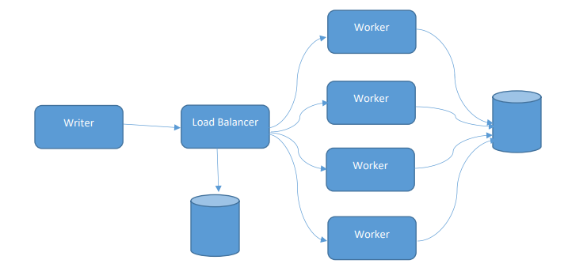
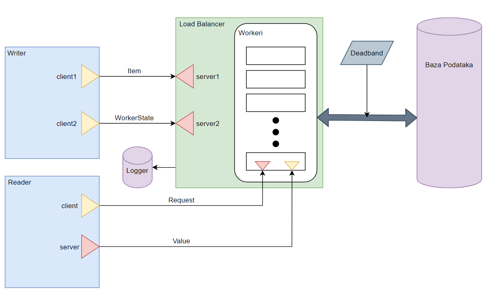
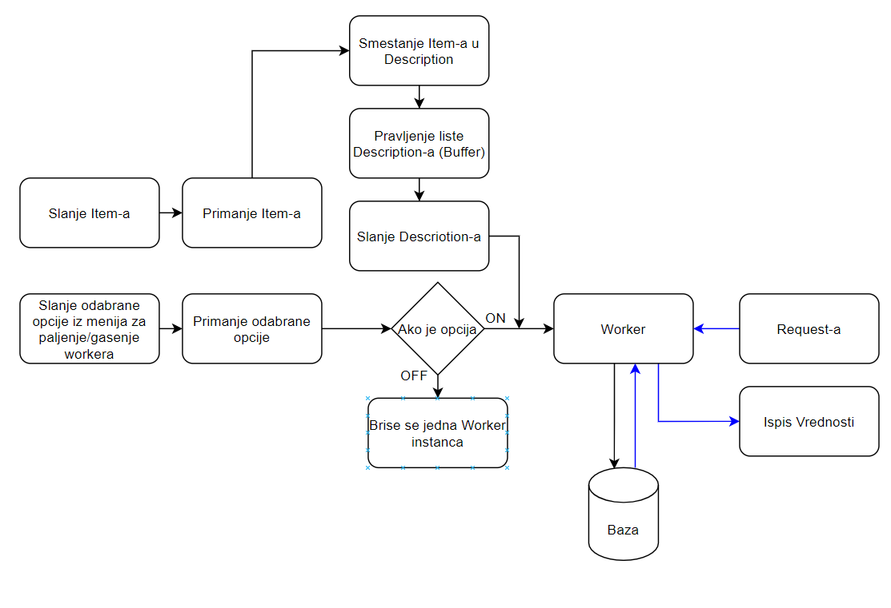

Razvoj Elektroenergetskog softvera 
Predmeni zadatak 3
========
  
1.  **Uvod**

Projektni zadatak 3 simulira rad I komunikaciju Load Balacner modula
koji ravnomernim raspoređivanjem posla između workera utiče na povećanje
perofrmansi celog sistema.

Zadatak sistema jeste da korsiniku omogući upis u bazu podataka kao I
čitanje podataka iz baze na zahtev klijenta.

Sistem se sastoji iz 6 kompnenti:

1.  Load Balancer

2.  Worker

3.  Writer

4.  Reader

5.  Baza podataka

6.  Logger

    
**2. Dizajn**

**Writer** predtavlja softversku komponentu čiji je zadatak da load
balanceru prosleđjuje podatke na svake dve sekunde u vidu item-a. Svaki
item se sastoji od *code* i *value* dela. Gde code predstavlja enum
vrerednost koja moze biti:

1.  CODE_ANALOG

2.  CODE_DIGITAL

3.  CODE_CUSTOM

4.  CODE_LIMITSET

5.  CODE_SINGLENOE

6.  CODE_MULTIPLENODE

7.  CODE_CONSUMER

8.  CODE_SOURCE

dok value predstvalja celobrojnu vrednost izmedju 1 i 500.

Writer takođe pruža mogućnost upravljanja workerima gde korisnik
odabirom jedne od opcija može upaliti ili ugasiti nekog od aktivnih
workera.

**Load Balancer** je komponenta koja od writer-a prima podatke koje
privrmeno smešta u svoj bafer, i prima zahtev za gašenje ili paljenje
workera. Prilikom paljenja novog workera kreira se jedinstveni id koji
se dodeljuje tom workeru i prosledjuju mu se podaci dobijeni od strane
writer komponente i kreira se dataSet u zavisnosti od code-a.

Raspored kodova i dataSet-ova:

>DataSet1: CODE_ANALOG\
CODE_DIGITAL

>DataSet2: CODE_CUSTOM\
CODE_LIMITSET

>DataSet3: CODE_SINGLENOE\
CODE_MULTIPLENODE

>DataSet4: CODE_CONSUMER\
CODE_SOURCE

**Worker** je komponenta čiji je zadatak obrada podataka dobijenih od
Load Balancera i upisivanje tih podataka u bazu.\
Drugi zadatak ove komponete jeste da po zahtevu korisnika dostavlja
podatke iz baze.

**Reader** komponenta omogućava čitanje podataka iz baze. Reader daje
mogućnost pretraživanja vrednosti po nekom vremenskom intervalu ili po
code-u.

Komunikacija izmedju komponenti ostvarena je putem tcp konekcije I
prilikom prenosa podataka koriscene su funkcije *Pickle.Load()* I
*Pickle.Dump()* kako bi se izvrsila serijalziacija I deserijalizacija
podataka.

U implementaciji sistema postignut je paralelizam (Load balancer u isto
vreme osluškuje da li je od writera dobio zahtev za aktiviranje/gašenje
nekog od workera I da li je od workera dobio novi podatak koji je
neophodo proslediti dalje). U tu svrhu korišcene su biblioteke
*muliprocessing* I *thread*.
    
**3. Scenario rada**

Writer komponenta u svakom momentu korinsiku daje mogućnost paljenja i
gašenja aktivih workera. Pored toga, na svake 2 sekunde writer Load
Balanceru šalje podatke u vidu Item-a (code, value).

Primljeni podaci na Load Balancer-u se najpre smeštaju u interni bafer,
nakon čega se prosleđuju dalje workerima na obradu. Podela opterećenja
između workera funkcioniše po RoundRobin principu.

Load Balancer vodi evidenciju o svim aktivnim workerima i na osnovu
dobijenog zahteva od writera pali ili gasi workere.

Worker dobija podatke od Load Balancera, pakuje ih u svoju internu
strukturu, na osnovu uslova provera da li mogu biti smšteni u bazu nakon
čega ukoliko je uslov ispunjen te podatke smešta u bazu zajedno sa
timestampom upisa.

Klijent putem Reader-a zahteva pretragu po vremenskom interalu ili po
nekom specificnom code-u.

Nakon toga Worker po zahtevu klijenta šalje podatke Reader komponenti.

U toku rada sistema, prilikom svkaog upisivanja podataka u bazu ili
njihovog iščitavanja, logger komponenta bleži svaku tu aktivnost u txt
fajl.

Dijagram aktivnosti sistema
    
**4. Opis rešenja**

 
4.1 Klasa Load Balancer

>class LoadBalancer:

Metode:

> def CreateServerSocket1() - kreira serverski soket putem kojeg ce biti
> omoguceno slanje podataka sa writera na load balancer(server).
>
> def CreateServerSocket2()- kreira serverski soket putem kojeg ce biti
> omogućeno slanje informacija o aktivaciji/gašenju workera.
>
> def ReceiveItem()- poziva funkciju za kreiranje soketa, nakon cega
> otvara komunikaciju na definisanom portu, periodicno preuzima paket od
> writer komponetne i vrsi deserijalizaciju preuzetih podataka.
>
> def ForwardDataPrepare(item) - Formira objekat klase Description.
>
> def Buffer() - dobavlja objekat klase Description iz liste descList
> ukoliko lista nije prazna. Funkcionise po principu FIFO( First In
> First Out).
>
> def ReceiveState() - poziva funkciju za kreiranje soketa, nakon čega
> otvara komunikaciju na definisanom portu I osluškuje da li je writer
> zahtevao paljenje ili gašenje nekog od workera.

  4.2. Klasa Writer

:class Writer:

Metode:

> def SendItem() - kreira random vrednosti Item-a, vrši serijalizaciju
> podataka I slanje na load balanccer komponentu.
>
> def SendState() - Na konzoli ispisuje moguce opeeracije nad workerima
> I u zavisnosti od korisnikovog izbora šalje izabranu opciju load
> balanceru.
> def CreateClientSocket1() - kreira soket i otvara konekciju ka load balancer-u.
> def CreateClientSocket2() - kreira soket i otvara konekciju ka load balancer-u.
> def inputState(self) - Ispisuje na konzoli moguce operacije nad workerima, beleži korisnikov izbor i prosleđuje ga load balancer-u.

  
4.3 Klasa Reader

> class Reader:

Metode:

> def DoReader():

> def CreateServerSocket() - otvara serversku konekciju ka worker
> komponenti
>
> def CreateClientSocket() - otvara klijentsku konekciju ka worker
> komponenti
>
> def ReceiveData() - vrši deserijalizaciju primljenih podataka I
> ispisuje vrednosti na ekran
>
> def RequestCode() - Poziva optionInput I povratnu vrednost te funkcije
> šalje workeru.
>
> def optionInput() - Na konzoli ispisuje sve moguce opcije, korisnik
> ima izbor da li će odredji objekat traziti po vremenskom intervalu ili
> po code-u.
>
> def timeFromFunction() - Ukoliko koirsnik oodabere pretražvanje po
> intervalu, preuzima sa konzole kolika će biti donja granica.
>
> def timeToFunction() - Ukoliko koirsnik oodabere pretrazivanje po
> intervalu, preuzima sa konzole kolika će biti gornja granica.
>
> def codeSelectionFunction() Ukoliko koirsnik oodabere pretraživanje po
> code-u, preuzima sa konzole vrednost code-a.
  

4.4 Klasa Worker

> class Worker:

Metode:

>def GetData(self, code: str, db_path=None) - metoda koja reader
komponenti nudi sve podatke za određeni code, a on proverava da li
podatak pripada vremenskom intervalu.

>def GetLastValueByCode(self, code: str, db_path=None) - metoda koja
izvalči pdoatke iz baze.

>def \_\_SaveLocally(self, data: Description) - pretvara podatak tipa
Description u podatak tipa CollectionDescription.

>def SaveData(self, data: Description) - čuva dobijene podatke od load
balancera.

>def \_\_EvaluateDataState(self)- provjerava da li je dataset popunjen,
da li su su obe vrednosti u strukturi pre snimanja u bazi.

>def \_\_ProcessData(self, cd_statuses: list) - proverava da li dobijeni
podaci treba da budu upisani u bazu.

>def ValidateValue(self, worker_property: WorkerProperty, db_path=None) -
proverava da li je u pitanju CODE.DIGITAL,ako nije proverava da li
podatak izlazi iz DeadBend-a.

>def GetValue(self, code: str, db_path=None)-varaća posljednju vrednost.

>def \_\_RemoveCheckedWorkerProperties(self) - metoda za brisanje
nepotrebnih podataka, koji nisu prosli kroz validaciju.

>def \_\_CreateDatabaseTables(db_path=None) -metoda za kreiranje tabela
baze podataka.

>def \_\_GetDatabasePath() - metoda za genersianje putanje.

>def CheckDeadband(old_value: int or float, new_value: int or float) -
proverava da li je razlika izmedju stare i nove vrijednosti veća od 2%.

>def GetDataSetByCode(self, code: str) - metoda koja vraća kojem datasetu
pripada neki code.
